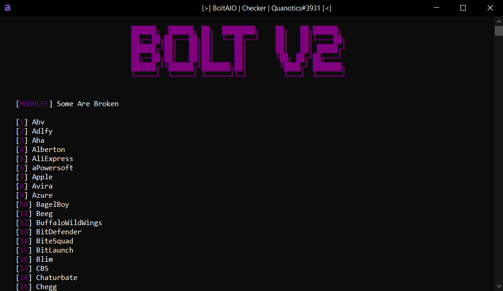

   
  <strong>Demonstration of how Authorization APIs can be taken advantage of.
   
  
  

  <a href="https://github.com/audioo/Bolt-AIO/releases/latest">Download</a>
  &nbsp;&nbsp;&nbsp;|&nbsp;&nbsp;&nbsp;
  <a href="https://discord.gg/kTZ6q2aEJgp">Discord</a>

  Repository created and formatted by <a href="https://github.com/audioo">audioo</a>

